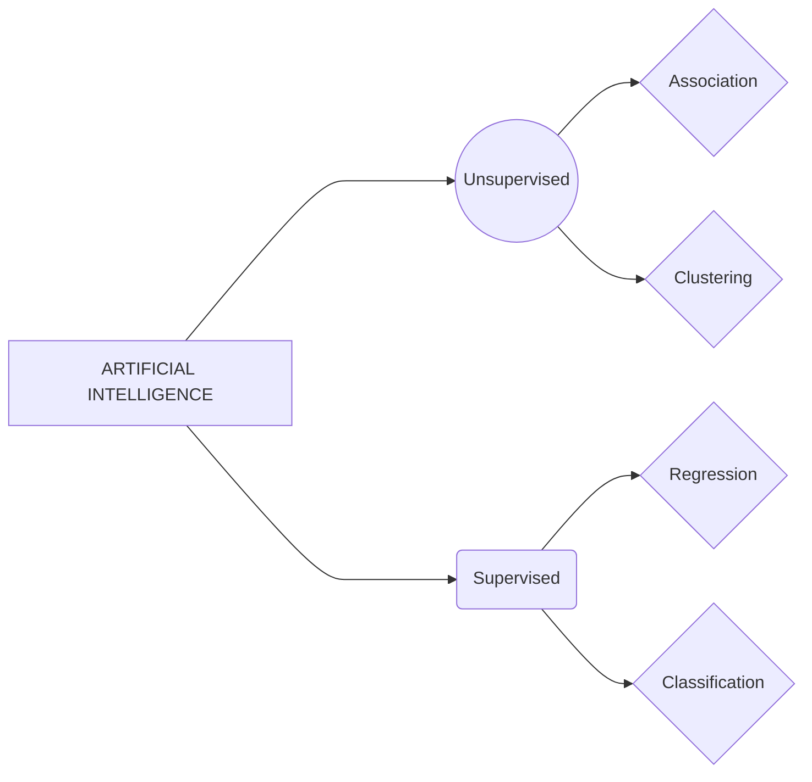

# Data-Science-and-Analytics-2024
Summary of classes taken in DSA Course 2024

## *Demystification of terms: Artificial Intelligence, Data Science, Machine Learning*
Starting from the history of artificial intelligence, we came till the present world scenario leading up to nobel prize in physics for the work in neural networks. Artifical intelligence first started by the invention of a device called perceptron, by **Frank Rosenblatt**. But this device had its limitations since it was only a *single layer of neural networks* and some functions such XOR in gated circuits cannot be done using this device. When this was published along with its proof, nobody dared to venture into the AI field anymore, since they were convinced no answers or results could be made out from them. *Except one.* **Geoffrey Hinton** did not put his steps backwards and continued in his own way with research related to AI and neural networks. He did not utilise any funds from defense department since he believed it was used for purposes which did not bring any good. So he moved his research to University of Toronto, Canada and continued studying neural networks involving multiple layers, forming *deep neural networks*.

The below flowchart represents the classification of Artificial Intelligence. In classification, the datas will be discrete values and in regression type, the datas will be continuous. Apart from supervised and unsupervised learning, there is another type called Reinforced learning wherein the model is made to learn datas and make decisions to achieve the best results.

## *MACHINE LEARNING*

Machine learning is all about the ability of computer to learn without being explicitly programmed. Machine learning has two components, classical learning and deep learning. Rule-based systems won't be applicable at all times. 

## Python
Python is a high level, object-oriented and interpreted programming language which is used widely to write codes. Python is familiar among its users because of its simple nature. It is primarily stored in the RAM, then moved to hardware. Space for storage allocation is determined using the data type. For 256 characters, 8 bits are being used. If it is a Boolean function, only 1 bit is required. Python uses various libraries such as NumPy, Scikitlearn, Matplotlib for large multi dimensional array processing.These libraries can be saved so that it can be shared with public.

### *Array visualization in Python*
A color image is a 3-D matrix. If it is a black and white image, then it will be single layered. Taking the average of the 3 pixels in a color image will convert the picture into black and white. Difference between two neighboring pixels will give the outline of the image.

## DATA SCIENCE LIFE CYCLE
1. **Business Understanding**
Here, we will try to identify a pattern from the available set of data. These are then converted into actionable insights to generate business or business ideas. So, we identify the problem, analyze what kind of data is needed, collect the data and then finally analyze the data.

2. **Data Mining**
This refers to collection of data from various resources.

3. **Data Cleaning**
The data initially collected will contain both unstructured and structured data. So the data is being converted into a structured format in this step.

4. **Data Exploration**
Exploratory Data Analysis is used to analyze the relation between data using graphs or other tools like scatter plot, heat map, histograms, etc.

5. **Feature Engineering**
In this step, we identify a parameter to help analyze using domain expertise. We will combine existing parameters to create some useful variable. 
For example,

7. **Predictive Modeling**
8. **Data Visualization**

