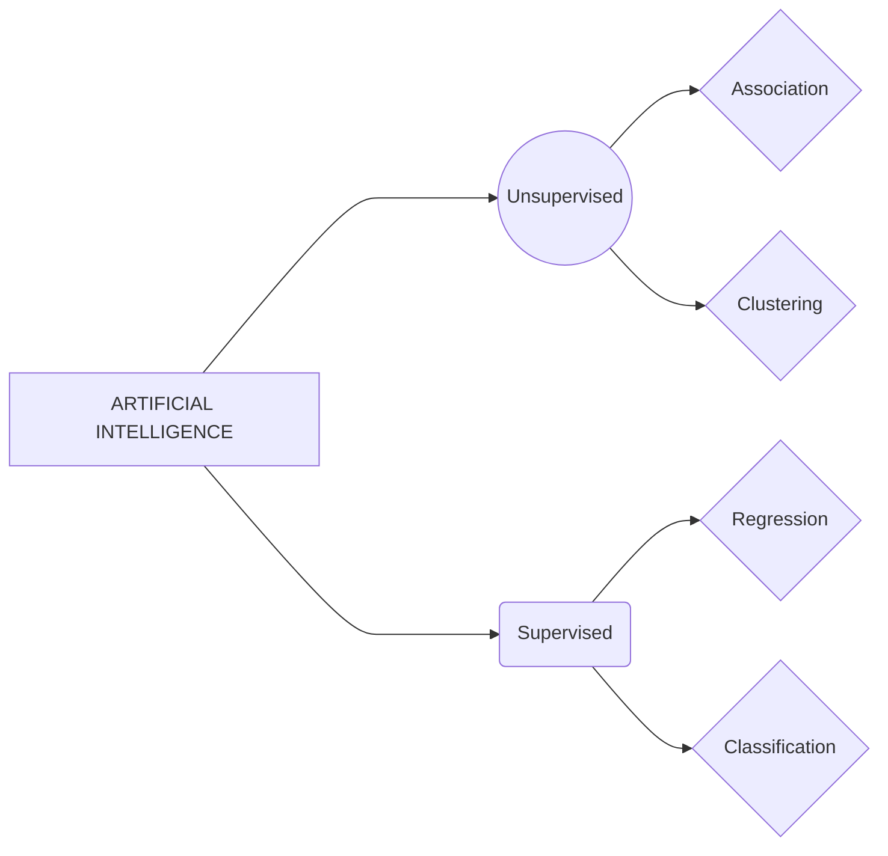

# Data-Science-and-Analytics-2024
Summary of classes taken in DSA Course 2024

## *Demystification of terms: Artificial Intelligence, Data Science, Machine Learning*
Starting from the history of artificial intelligence, we came till the present world scenario leading up to nobel prize in physics for the work in neural networks. Artifical intelligence first started by the invention of a device called perceptron, by **Frank Rosenblatt**. But this device had its limitations since it was only a *single layer of neural networks* and some functions such XOR in gated circuits cannot be done using this device. When this was published along with its proof, nobody dared to venture into the AI field anymore, since they were convinced no answers or results could be made out from them. *Except one.* **Geoffrey Hinton** did not put his steps backwards and continued in his own way with research related to AI and neural networks. He did not utilise any funds from defense department since he believed it was used for purposes which did not bring any good. So he moved his research to University of Toronto, Canada and continued studying neural networks involving multiple layers, forming *deep neural networks*.

The below flowchart represents the classification of Artificial Intelligence. In classification, the datas will be discrete values and in regression type, the datas will be continuous. Apart from supervised and unsupervised learning, there is another type called Reinforced learning wherein the model is made to learn datas and make decisions to achieve the best results.

## *PYTHON*

